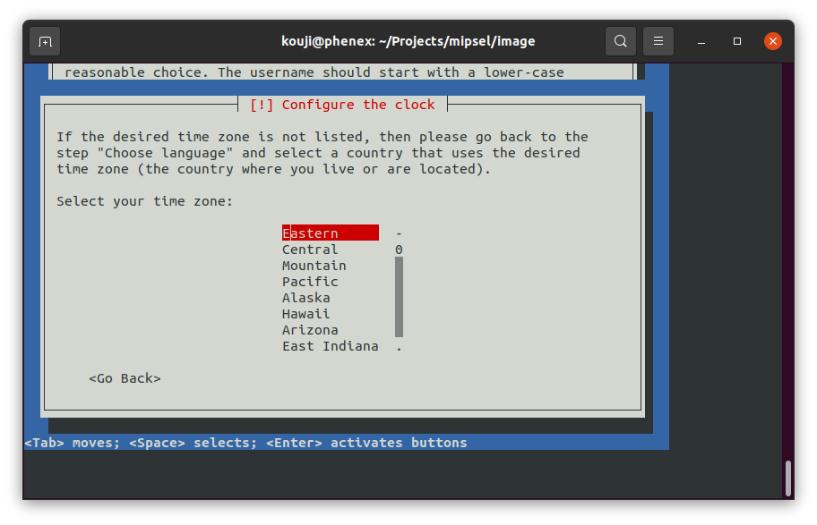
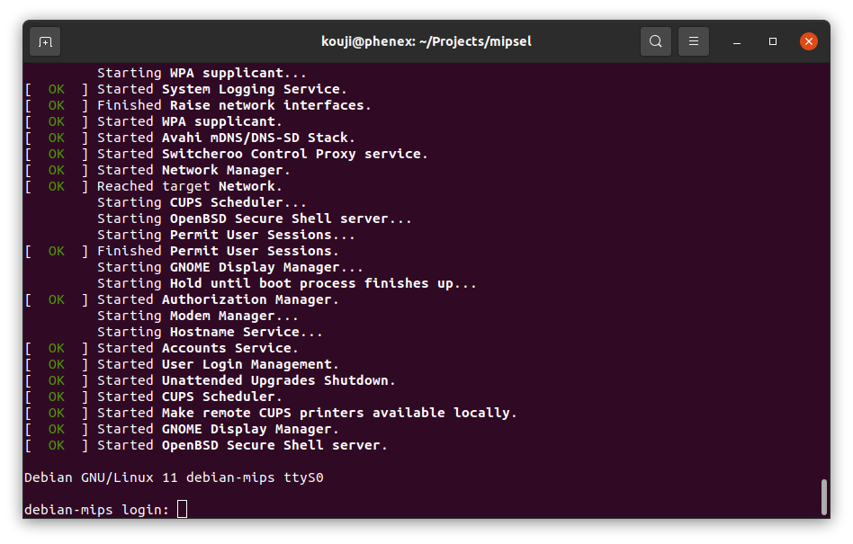

# Setup latest Debian mipsel on qemu malta

Reference:
  https://gist.github.com/extremecoders-re/3ddddce9416fc8b293198cd13891b68c

----

## How to use it

Perhaps the script needs to be modified slightly to match the latest image. I used [Latest Debian 11 (bullseye) from "debian-11.3.0-mipsel-netinst.iso"](http://cdimage.debian.org/cdimage/release/current/mipsel/iso-cd/debian-11.3.0-mipsel-netinst.iso) as a base.

1. Run `build.sh`, it will download cd image from debian server, build qcow virtual hard disk image and run debian installer.



2. Rebooted in finally installation step, choose `Execute shell` from menu and do `poweroff` command, then will exit qemu.

3. Ready to use. Run `run.sh` then raise up debian 11 mipsel on qemu!



### Enabled ssh forwarding on port 2222

```bash
ssh localhost -p 2222
```

Have fun!

----

## Background

It's completely off-topic, and probably a strange nerd story :)

I am developing [a .NET library for video capture](https://github.com/kekyo/FlashCap).
I thought this library should be tested in a variety of environments in order to be truly multi-platform.
So, I was looking for a somewhat minor environment in which .NET (actually mono) would work,
and ["Imagination Creator Ci20" was found.](https://uk.rs-online.com/web/p/single-board-computers/1253305)

The Ci20 is a MIPS 32-bit architecture that is still barely available and can operate as a USB host.
It seemed feasible to perform video capture via V4L2, supporting USB Video Class.
So, we quickly obtained this board and found that only supports Debian 8 (jessie) and
Moreover, it seemed to have been removed from the supported list as a beta release.

After [some information and trial and error](https://gist.github.com/kekyo/1d851907bf5b59ddb204448de3b18383),
I succeeded in applying the latest binary packages for Debian 8.
Apparently there is still an eMMC access bug in the kernel, which causes the system to stop
with UBIFS-derived panic when I/O is under high load.
Also, I need a relatively new version of Clang, but Debian 8 only has an older version,
and If I try to build it on my own, I get the above panic and am out of luck.

I wish I could fix this kernel fundamentally, but unfortunately, I do not have that much knowledge.
So I have decided to take other steps.

I realized that building the code on a modern Debian 11 using qemu's mipsel emulation would work fine,
so I created this script by trial and error from my sources.

----

## License

MIT
